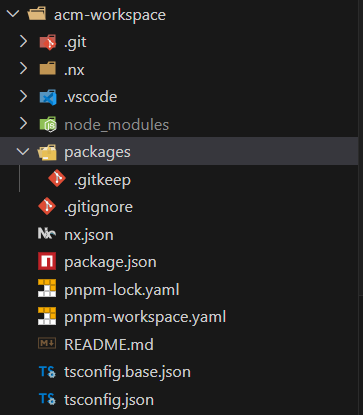

Created an **Nx workspace** using the command:

```bash
pnpm create nx-workspace@latest acm-workspace -pm=pnpm
```

Chosen:

* **Framework: None** → Meaning you started with a minimal setup (no Angular, React, etc.)
* **CI Setup: Do it later**


---

**Break down everything** inside the `acm-workspace` directory **file by file, folder by folder**, especially focusing on:

* `nx.json`
* `package.json`
* `pnpm-workspace.yaml`
* General Nx & workspace structure

---

## 🗂️ Folder & File Overview

### 1. `.git/`

Git repository metadata. You initialized a git repo.

### 2. `.nx/`

Nx's internal cache and metadata.

* Used for computation caching
* Stores project graph and task runner results

You typically don’t modify this manually.

### 3. `.vscode/`

Workspace-specific settings for VS Code.

* Could include launch configs, extensions, formatting rules, etc.

### 4. `node_modules/`

Standard directory where all project dependencies are installed.

---

### 5. `packages/`

This is your **apps/libs monorepo folder**.
Because your `pnpm-workspace.yaml` says:

```yaml
packages:
  - "packages/*"
```

This tells PNPM to treat each subfolder in `packages/` as a **separate package** (app or library) — typical in a monorepo.

---

### 6. `.gitignore` / `.gitkeep`

* `.gitignore` – Tells Git which files/folders to ignore (like `node_modules`, build outputs, etc.)
* `.gitkeep` – Placeholder to keep an empty directory in git (since git doesn’t track empty folders)

---

### 7. `README.md`

A markdown file to describe your workspace (currently likely empty or with a stub from Nx).

---

## 🔧 Configuration Files

---

### ✅ `pnpm-workspace.yaml`

This tells **PNPM** what packages exist in the monorepo and how to handle dependencies.

```yaml
packages:
  - "packages/*"
```

> Looks for workspaces (projects) inside the `packages/` folder.

```yaml
autoInstallPeers: true
```

> If a package has missing peer dependencies, PNPM auto-installs them.

```yaml
strictPeerDependencies: false
```

> Disables peer dependency resolution errors. Useful during development or with mismatched dependencies.

---

### ✅ `package.json`

This is the **root workspace package.json**. It declares:

* Workspace metadata
* Dev tools (like Nx, TypeScript)
* Scripts (currently empty)
* Dev dependencies shared across the monorepo

```json
{
  "name": "@acm-workspace/source",
  "version": "0.0.0",
  "license": "MIT",
  "scripts": {},
  "private": true,
  "dependencies": {},
  "devDependencies": {
    "@nx/js": "21.6.4",                // Nx plugin for JS/TS projects
    "@swc-node/register": "~1.9.1",     // Enables SWC-based runtime transpilation (Node.js)
    "@swc/core": "~1.5.7",              // SWC compiler (faster than Babel)
    "@swc/helpers": "~0.5.11",          // Runtime helpers for SWC
    "nx": "21.6.4",                     // Nx CLI and core engine
    "tslib": "^2.3.0",                  // Runtime helpers for TypeScript
    "typescript": "~5.9.2"              // TypeScript compiler
  }
}
```

> `private: true` – Prevents accidental publishing to npm.

---

### ✅ `nx.json`

This is the **main config file for Nx**. Controls project graph behavior, input dependencies, plugins, and caching.

Let's break this down in detail:

```json
{
  "$schema": "./node_modules/nx/schemas/nx-schema.json",
```

> JSON schema reference for validation & IDE IntelliSense.

```json
  "defaultBase": "master",
```

> The default git branch to compare changes against (for affected commands).

```json
  "namedInputs": {
    "default": [
      "{projectRoot}/**/*",
      "sharedGlobals"
    ],
    "production": [
      "default"
    ],
    "sharedGlobals": []
  },
```

> These define **input sets** for caching & task optimization.

* `default` → All files in the project and shared globals.
* `production` → Alias for `default` (can be customized later).
* `sharedGlobals` → Global files used by all (e.g., `tsconfig.json`, `.eslintrc`), currently empty.

Nx uses these to know **what to watch for changes** when running tasks like build, test, lint, etc.

```json
  "plugins": [
    {
      "plugin": "@nx/js/typescript",
```

> Enables Nx to understand **JS/TS projects**, adds TypeScript build/typecheck support.

```json
      "options": {
        "typecheck": {
          "targetName": "typecheck"
        },
```

> Maps the custom `typecheck` task to the underlying Nx task.

```json
        "build": {
          "targetName": "build",                       // Maps to the target used in `project.json`
          "configName": "tsconfig.lib.json",           // Custom tsconfig for build (used in libs)
          "buildDepsName": "build-deps",               // Internal target for building dependencies
          "watchDepsName": "watch-deps"                // Internal target for watching deps
        }
      }
    }
  ]
}
```

This entire section is about teaching Nx how to:

* Build your TS packages
* Type-check them
* Manage dependencies smartly

---

### ✅ `tsconfig.base.json` / `tsconfig.json`

These are the root TypeScript configuration files.

* `tsconfig.base.json` → Shared settings across all packages/projects (extends this in child projects)
* `tsconfig.json` → Typically for the root context, might just extend `tsconfig.base.json`

These files help Nx and TypeScript understand:

* Path aliases
* Compiler options (e.g., strict mode, module system)
* TypeScript project references (when used)

---

## ✅ Workspace Summary

Your Nx + PNPM workspace is now:

| Feature       | Setup                                                    |
| ------------- | -------------------------------------------------------- |
| **Tooling**   | Nx (for build orchestration), PNPM (for dependency mgmt) |
| **Packages**  | Monorepo managed in `packages/` folder                   |
| **CI**        | Not yet configured (you chose "do it later")             |
| **Framework** | None (you’ll add your own or stay framework-less)        |
| **Language**  | TypeScript (SWC used for speed)                          |
| **Caching**   | Enabled via Nx with `namedInputs`                        |

---
